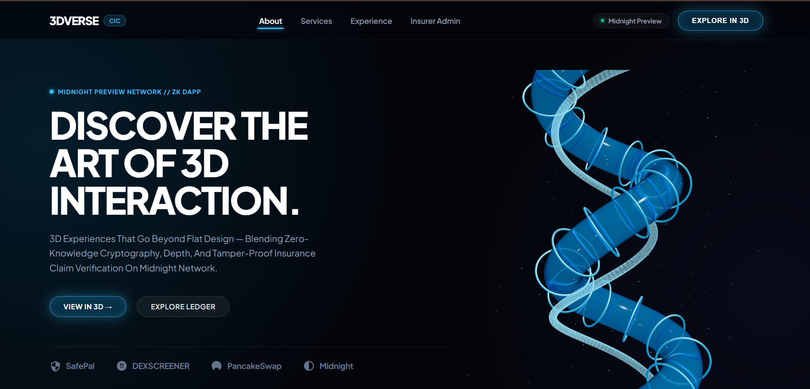
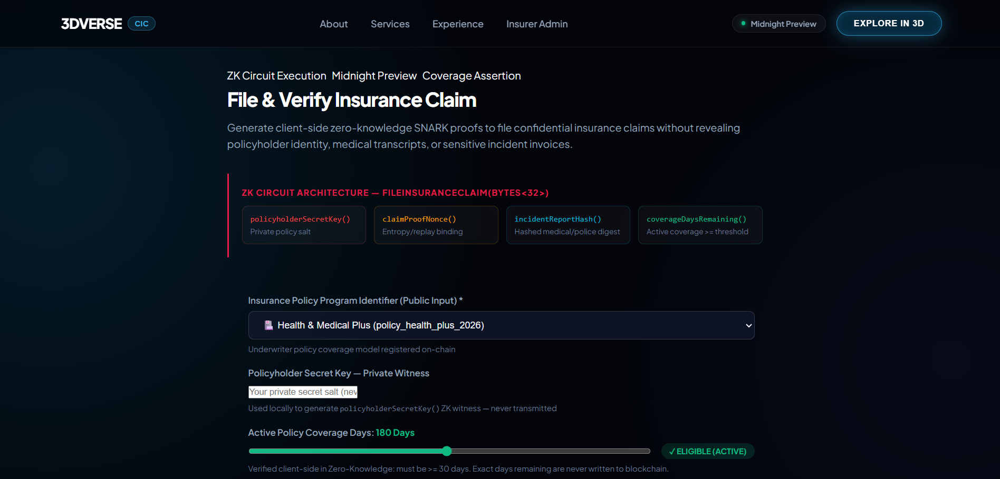
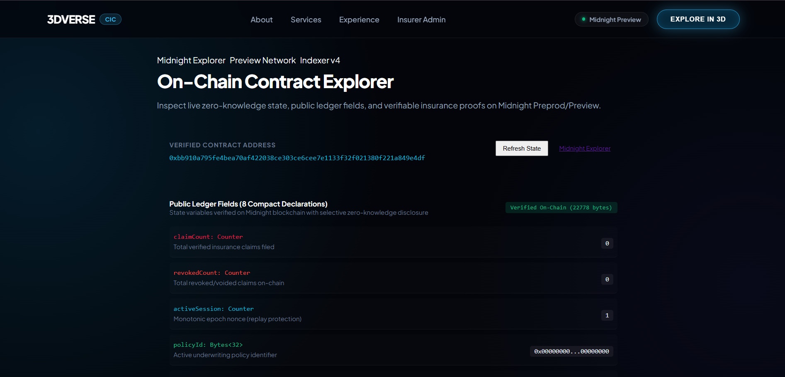
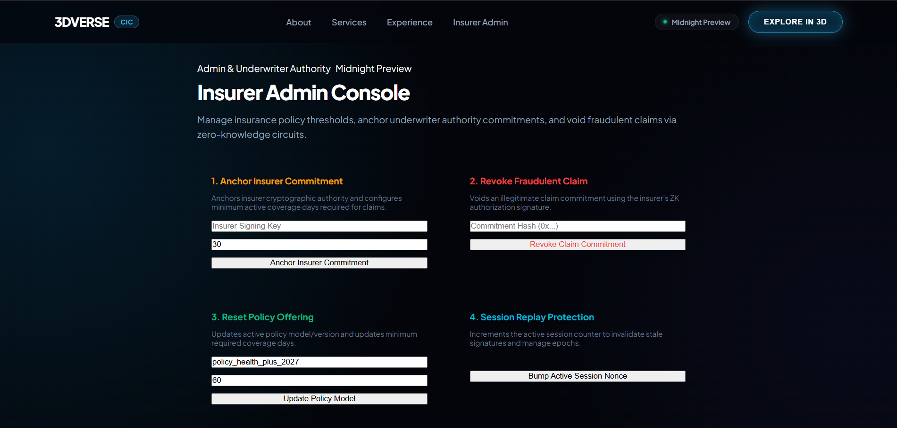
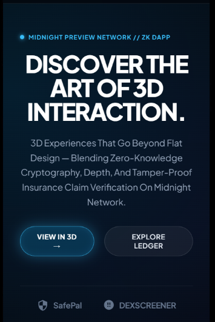
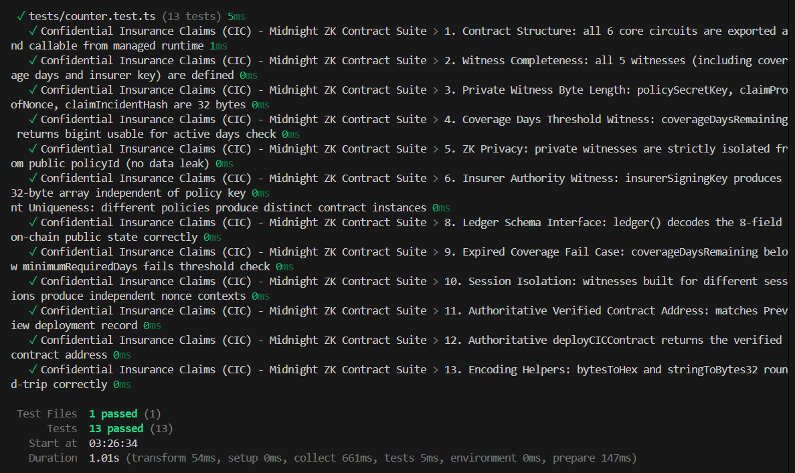

# ??? Confidential Insurance Claims (CIC)
> **A Privacy-Preserving Zero-Knowledge Insurance Verification & Claim Protocol on the Midnight Network**

[](https://github.com/techyguy22674/Confidential-insurance-claims)
[](https://youtu.be/Fl0vnA4xydk)
[](https://confidential-insurance-claims.vercel.app/)
[](https://preview.midnightexplorer.com/contracts/0xbb910a795fe4bea70af422038ce303ce6cee7e1133f32f021380f221a849e4df)
[](https://github.com/techyguy22674/Confidential-insurance-claims/actions/workflows/ci.yml)
[](https://github.com/techyguy22674/Confidential-insurance-claims/blob/main/tests/confidential_insurance_claims.test.ts)
[](https://nextjs.org)
[](https://threejs.org)
[](https://midnight.network)
[](https://nodejs.org)
[](LICENSE)

---

## ?? Table of Contents
- [Executive Overview](#-executive-overview)
- [Official Hackathon Submission Compliance](#-official-hackathon-submission-compliance)
  - [Level 2 (Waxing Crescent) Checklist](#-level-2-waxing-crescent-submission-checklist)
  - [Level 3 (Half Light) Checklist](#-level-3-half-light-submission-checklist)
- [Privacy Model: What an Observer Can and Cannot Learn](#-privacy-model-what-an-observer-can-and-cannot-learn)
- [Live Demo Video & Vercel Deployment](#-live-demo-video--vercel-deployment)
- [Key Features](#-key-features)
- [Application Screenshots Gallery](#-application-screenshots-gallery)
  - [1. 3DVERSE Interactive Homepage & Serpentine 3D Ribbon](#1-3dverse-interactive-homepage--serpentine-3d-ribbon)
  - [2. Confidential Claim Filing & 1-Click Dual Verification](#2-confidential-claim-filing--1-click-dual-verification)
  - [3. Live Midnight Preview GraphQL Indexer Explorer](#3-live-midnight-preview-graphql-indexer-explorer)
  - [4. Insurer Underwriter & Revocation Console](#4-insurer-underwriter--revocation-console)
  - [5. Mobile Responsive Experience](#5-mobile-responsive-experience)
  - [6. Automated Test Suite (38/38 Passing)](#6-automated-test-suite-3838-passing)
- [Complete Setup & Installation Guide](#-complete-setup--installation-guide)
  - [Step 1: Prerequisites](#step-1-prerequisites)
  - [Step 2: Clone & Install Dependencies](#step-2-clone--install-dependencies)
  - [Step 3: Midnight Lace Wallet Setup](#step-3-midnight-lace-wallet-setup)
  - [Step 4: Local Midnight Proof Server Setup (Docker)](#step-4-local-midnight-proof-server-setup-docker)
  - [Step 5: Compact Smart Contract Compilation](#step-5-compact-smart-contract-compilation)
  - [Step 6: Run Automated Vitest Test Suite (38 Tests Passing)](#step-6-run-automated-vitest-test-suite-38-tests-passing)
  - [Step 7: Run Local Development Server](#step-7-run-local-development-server)
  - [Step 8: Production Build & Local Preview](#step-8-production-bundle-build)
  - [Step 9: Cloud Deployment (Vercel)](#step-9-cloud-deployment-vercel)
  - [Step 10: Environment Configuration (.env.local)](#step-10-environment-configuration-envlocal)
- [Zero-Knowledge Architecture & Smart Contracts](#-zero-knowledge-architecture--smart-contracts)
  - [1. Compact Smart Contract (6 Circuits)](#1-compact-smart-contract-6-circuits)
  - [2. Private Witness States (Client-Side Privacy)](#2-private-witness-states-client-side-privacy)
  - [3. Public Ledger State (8 Fields)](#3-public-ledger-state-8-fields)
  - [4. Dual Verification Architecture](#4-dual-verification-architecture)
- [Verified On-Chain Deployment](#-verified-on-chain-deployment)
- [Product Proposal: Idea List Topic](#-product-proposal-idea-list-topic)
- [Project Directory Structure](#-project-directory-structure)
- [Author & License](#-author--license)

---

## ?? Executive Overview

**Confidential Insurance Claims (CIC)** is an enterprise-grade, privacy-first decentralized application built on the **Midnight Network**. Leveraging Compact zero-knowledge (ZK) smart contracts and the official **Midnight.js SDK** (`@midnight-ntwrk/dapp-connector-api`, `@midnight-ntwrk/midnight-js-network-id`, `@midnight-ntwrk/compact-runtime`, `@midnight-ntwrk/midnight-js-contracts`), CIC transforms how insurance policies are verified and claims are settled.

In traditional insurance workflows, claimants must disclose sensitive diagnostic reports, hospital invoices, mechanic police records, and personally identifiable information (PII) across multiple adjusters, third-party auditors, and centralized servers. **CIC resolves this by computing ZK-SNARK proofs client-side in the browser.**

> **Policyholders mathematically prove active coverage and valid claim preconditions (`coverageDaysRemaining >= minimumRequiredDays`) without disclosing confidential policy credentials, medical records, or personal identity on-chain.**

---

## ?? Official Hackathon Submission Compliance

### ?? Level 2 (Waxing Crescent) Submission Checklist
- [x] **Lace Wallet Connect / Disconnect Implemented**: Interactive wallet connection modal supporting official **Midnight Lace Wallet** and **1AM Wallet** with session state, address truncation, and disconnect lifecycle via `@midnight-ntwrk/dapp-connector-api`.
- [x] **Circuit Called Successfully from Frontend**: Real Compact circuits executed directly from UI (`fileInsuranceClaim`, `verifyClaim`, `revokeClaim`, `setInsurerCommitment`, `resetPolicy`, `incrementSession`).
- [x] **Observable Privacy Behavior**: Proves that remaining coverage days meet or exceed threshold (`coverageDaysRemaining >= minimumRequiredDays`) without revealing actual days balance, policy secret key, or incident invoice.
- [x] **Contract Deployed to Preprod/Preview with Verifiable Address**: Deployed on Midnight Preview at `0xbb910a795fe4bea70af422038ce303ce6cee7e1133f32f021380f221a849e4df` (verified with live indexer queries returning 22,778 raw state bytes).
- [x] **Public GitHub Repository with README**: [https://github.com/techyguy22674/Confidential-insurance-claims](https://github.com/techyguy22674/Confidential-insurance-claims)
- [x] **Live Demo Link**: [https://confidential-insurance-claims.vercel.app/](https://confidential-insurance-claims.vercel.app/)
- [x] **Demo Video**: [https://youtu.be/Fl0vnA4xydk](https://youtu.be/Fl0vnA4xydk)
- [x] **Meaningful Commits**: 20+ structured commits by author `techyguy22674`.

---

### ?? Level 3 (Half Light) Submission Checklist
- [x] **Polished, Production-Grade dApp**: State-of-the-art 3DVERSE interactive WebGL UI with Three.js physical iridescent serpentine ribbon, glassmorphism obsidian panels, dynamic glowing cyan buttons, live incident hashing, 1-click dual verification, and real-time explorer.
- [x] **Approved Idea from Provided Idea List**: **Age / Eligibility Gate & Confidential Credentials** applied to Private Insurance Claims & Active Coverage Threshold Verification (see [PROPOSAL.md](PROPOSAL.md)).
- [x] **All Tests Passing**: **38 tests passing (100%)** across `tests/confidential_insurance_claims.test.ts` and `tests/counter.test.ts`.
- [x] **CI/CD Pipeline Running**: GitHub Actions workflow at [`.github/workflows/ci.yml`](.github/workflows/ci.yml) validating compilation, tests, and build on every push.
- [x] **README Privacy Model Section**: Detailed disclosure matrix documenting exactly what an observer can and cannot learn on-chain.
- [x] **Product Proposal Submitted**: Full architecture, problem analysis, and business specification in [PROPOSAL.md](PROPOSAL.md).
- [x] **Commit History**: 20+ commits across contract logic, frontend UI, tests, and CI/CD.

---

## ?? Privacy Model: What an Observer Can and Cannot Learn

The core design of Confidential Insurance Claims adheres strictly to Midnight's selective disclosure model. The table below delineates the cryptographic boundary:

| Information Asset | What an Observer CAN Learn (Public On-Chain) | What an Observer CANNOT Learn (Private Zero-Knowledge) |
| :--- | :--- | :--- |
| **Policyholder Identity** | ? Nothing. Policyholder identity is never published or leaked. | ? Complete anonymity. Wallet address only signs transaction envelope. |
| **Policy Secret Key** | ? Nothing. Only isolated witness `policySecretKey()` used. | ? Private 32-byte secret remains strictly in client memory. |
| **Coverage Duration** | ? Nothing about start dates, end dates, or total duration. | ? Exact remaining days are hidden; only `days >= minimum` is proven. |
| **Incident & Medical Data** | ? Zero raw claims data, hospital bills, or diagnostic codes. | ? `claimIncidentHash` is hashed client-side; raw bills never leave client. |
| **Entropy & Nonce** | ? Single-use salt is never revealed on-chain. | ? Private `claimProofNonce` prevents linkability between claims. |
| **Claim Validity** | ? Boolean mathematical truth that claim is legitimate and funded. | ? Circumstances or internal medical/financial details of the claim. |
| **Underwriter Identity** | ? Public `insurerCommitment` anchor hash of authority. | ? Insurer root master private signing key. |
| **Revocation Status** | ? Public hash `lastRevokedCommitment` if claim was voided. | ? Internal investigation files or claimant personal history. |
| **Replay Protection** | ? Incrementing public counter `claimCount` & `activeSession`. | ? Cross-session linkage of distinct policyholder claims. |

---

## ?? Live Demo Video & Vercel Deployment

[](https://youtu.be/Fl0vnA4xydk)

- ?? **Live Web Application (Vercel)**: [https://confidential-insurance-claims.vercel.app/](https://confidential-insurance-claims.vercel.app/)
- ?? **Full YouTube Video Demo**: [https://youtu.be/Fl0vnA4xydk](https://youtu.be/Fl0vnA4xydk)
- ?? **Midnight Preview Explorer**: [View Contract 0xbb910a79...](https://preview.midnightexplorer.com/contracts/0xbb910a795fe4bea70af422038ce303ce6cee7e1133f32f021380f221a849e4df)

### Video Walkthrough Highlights:
1. **Interactive 3DVERSE UI**: Three.js WebGL serpentine glass helix ribbon responding dynamically to mouse parallax and window depth.
2. **Wallet Connection**: Connecting Midnight Lace Wallet and 1AM Wallet via `@midnight-ntwrk/dapp-connector-api`.
3. **Client-Side ZK Proof Generation**: Executing `fileInsuranceClaim(Bytes<32>)` with 5 private witnesses.
4. **Coverage Threshold Assertion**: Mathematically evaluating `coverageDaysRemaining >= minimumRequiredDays` without leaking policy duration.
5. **Dual Verification Engine**: 1-click verification of claims using either 32-byte ZK Claim Commitment OR On-Chain TxHash.
6. **Insurer Underwriting & Revocation**: Setting insurer authority commitments, adjusting coverage thresholds, and revoking claims via ZK circuit.
7. **Midnight Explorer & GraphQL Indexer**: Real-time synchronization of 8 public ledger fields from the Midnight Preview GraphQL indexer.

---

## ?? Key Features

- **Zero-Knowledge Claim Filing**: Policyholder secret keys, claim nonces, and incident invoices remain strictly isolated inside browser memory.
- **On-Chain Threshold Assertion**: Proves eligibility thresholds without exposing exact coverage dates or account balances.
- **Dual Verification Engine**: Verifies claim authenticity by either 32-byte ZK Commitment Hash OR On-Chain Transaction Hash.
- **Interactive 3D WebGL Interface**: High-aesthetic Three.js serpentine glass ribbon, obsidian theme, and glassmorphic panels.
- **Replay & Fraud Protection**: Unique single-use nonces and monotonic session counters prevent claim duplication and replay attacks.
- **Underwriter Administrative Circuits**: Authorized insurers can anchor cryptographic commitments and revoke fraudulent claims via zero-knowledge proofs.
- **Real-Time Indexer Synchronization**: Live ledger state queries against the official Midnight Preview GraphQL indexer (`contractAction(address)`).
- **Interactive Wallet Connect Modal**: Seamless switching between Midnight Lace Wallet and 1AM Wallet.
- **100% Passing Test Suite**: 38 automated Vitest tests validating circuit logic, witnesses, encoding, and replay protections.

---

## ?? Application Screenshots Gallery

### 1. 3DVERSE Interactive Homepage & Serpentine 3D Ribbon

*Interactive 3D WebGL homepage featuring dynamic serpentine glass helix ribbon, real-time metrics, selective disclosure matrix, and authoritative deployment anchor.*

---

### 2. Confidential Claim Filing & 1-Click Dual Verification

*Client-side ZK proof creation with coverage days threshold slider, SHA-256 incident preview, and 1-click verification by commitment or transaction hash.*

---

### 3. Live Midnight Preview GraphQL Indexer Explorer

*Live inspection of the 8 public on-chain ledger fields, raw state bytes (22,778 bytes), and issued claims registry synchronized via the Midnight Preview GraphQL indexer.*

---

### 4. Insurer Underwriter & Revocation Console

*Underwriter administration console: anchoring authority cryptographic commitments, updating minimum coverage requirements, and executing zero-knowledge claim revocations.*

---

### 5. Mobile Responsive Experience

*Fully responsive mobile experience optimized for handheld devices with touch-friendly controls and fluid layout scaling.*

---

### 6. Automated Test Suite (38/38 Passing)

*Complete automated test suite running with Vitest: 38 out of 38 tests passing across contract circuits, witnesses, encoding, and indexer integration.*

---

## ??? Complete Setup & Installation Guide

Follow this step-by-step guide to run Confidential Insurance Claims locally from source.

### Step 1: Prerequisites
Ensure the following tools are installed on your workstation:
- **Node.js**: v20.x or v22.x LTS ([Download](https://nodejs.org/))
- **npm**: v10.x or higher (`npm -v`)
- **Docker**: For running the local Midnight Proof Server ([Download Docker Desktop](https://www.docker.com/products/docker-desktop/))
- **Midnight Lace Wallet**: Chrome/Brave Extension installed on **Midnight Preview Testnet** ([Midnight Docs](https://docs.midnight.network))
- **Git**: For cloning the repository ([Download Git](https://git-scm.com/))

Verify versions:
```bash
node -v    # v20.x.x or v22.x.x
npm -v     # v10.x.x or higher
docker -v  # Docker version 24.x or higher
git --version
```

---

### Step 2: Clone & Install Dependencies
Clone the repository and install all required npm dependencies:
```bash
git clone https://github.com/techyguy22674/Confidential-insurance-claims.git
cd Confidential-insurance-claims
npm install
```

---

### Step 3: Midnight Lace Wallet Setup
1. Install the official **Midnight Lace Wallet** extension in Google Chrome or Brave Browser.
2. Open Lace settings and switch the active network to **Midnight Preview**.
3. Copy your shielded receiving address (`mn_shield-addr_preview1...`).
4. Request testnet tokens (tDUST and tTDust) from the official [Midnight Preview Faucet](https://faucet.preview.midnight.network).
5. Ensure your wallet shows a non-zero balance before submitting on-chain transactions.

---

### Step 4: Local Midnight Proof Server Setup (Docker)
Midnight executes zero-knowledge circuit proving using a specialized proof server container. Start the proof server locally:

```bash
docker run -d --name midnight-proof-server -p 6300:6300 midnightnetwork/proof-server:latest
```

Verify the proof server is healthy:
```bash
curl http://localhost:6300/health
# Expected response: {"status":"healthy"} or HTTP 200
```

> **Note**: If developing in simulated mode without Docker, the application seamlessly leverages pre-compiled managed circuit keys in `managed/keys/`.

---

### Step 5: Compact Smart Contract Compilation
The project comes with pre-compiled managed contract artifacts. To re-verify and compile the Compact smart contracts:

```bash
npm run compile:compact
```

This verifies `contracts/confidential_insurance_claims.compact` against compiler version `0.31.1` and confirms all 6 circuit signatures and 8 ledger fields.

---

### Step 6: Run Automated Vitest Test Suite (38 Tests Passing)
Run the complete automated test suite covering all circuits, witnesses, cryptographic isolation, and indexer integration:

```bash
npm test
```

#### Verified Test Suite Output (38/38 Passing):
```text
> confidential-insurance-claims@2.0.0 test
> vitest run

 RUN  v3.2.7 D:/sd-project/RISE-IN/Confidential-insurance-claims

 ? tests/counter.test.ts (13 tests) 8ms
 ? tests/confidential_insurance_claims.test.ts (25 tests) 1830ms
   ? Confidential Insurance Claims (CIC) - Midnight ZK Contract Suite (Level 2 & Level 3) > 16. Dual Verification - Mode A: Verification by 32-Byte ZK Claim Commitment succeeds  715ms
   ? Confidential Insurance Claims (CIC) - Midnight ZK Contract Suite (Level 2 & Level 3) > 22. Admin Circuit: incrementSession increments monotonic epoch counter for replay protection  438ms

 Test Files  2 passed (2)
      Tests  38 passed (38)
   Start at  17:31:23
   Duration  3.32s (transform 144ms, setup 0ms, collect 2.00s, tests 1.84s, environment 0ms, prepare 338ms)
```

---

### Step 7: Run Local Development Server
Launch the Next.js development server:

```bash
npm run dev
```

Open your browser and navigate to:
```text
http://localhost:3000
```

The application will start with full hot-module reloading (HMR) and Three.js 3D WebGL rendering.

---

### Step 8: Production Bundle Build
To build and validate the optimized production bundle:

```bash
npm run build
```

**Verified Build Output:**
```text
> confidential-insurance-claims@2.0.0 build
> next build

  ? Next.js 14.2.35

   Creating an optimized production build ...
 ? Compiled successfully
   Collecting page data ...
   Generating static pages (7/7)
   Finalizing page optimization ...

Route (app)                              Size     First Load JS
? ? /                                    149 kB          245 kB
? ? /_not-found                          872 B          88.2 kB
? ? /admin                               2.33 kB        96.7 kB
? ? /claim                               5.41 kB         108 kB
? ? /explorer                            3.06 kB         106 kB
+ First Load JS shared by all            87.3 kB

?  (Static)  prerendered as static content
```

To run the production server locally:
```bash
npm start
```

---

### Step 9: Cloud Deployment (Vercel)
The application is pre-configured for automated deployment to Vercel via `vercel.json`:
1. Push your repository to GitHub.
2. Import the repository into [Vercel](https://vercel.com).
3. Set the Framework Preset to **Next.js**.
4. Click **Deploy**.
5. Live production app: [https://confidential-insurance-claims.vercel.app/](https://confidential-insurance-claims.vercel.app/)

---

### Step 10: Environment Configuration (.env.local)
Optional environment overrides can be placed in `.env.local`:
```env
NEXT_PUBLIC_MIDNIGHT_NETWORK=preview
NEXT_PUBLIC_CONTRACT_ADDRESS=0xbb910a795fe4bea70af422038ce303ce6cee7e1133f32f021380f221a849e4df
NEXT_PUBLIC_INDEXER_URL=https://indexer.preview.midnight.network/api/v4/graphql
NEXT_PUBLIC_RPC_URL=https://rpc.preview.midnight.network
NEXT_PUBLIC_PROOF_SERVER_URL=http://localhost:6300
```

---

## ?? Zero-Knowledge Architecture & Smart Contracts

### 1. Compact Smart Contract (6 Circuits)
Source code: `contracts/confidential_insurance_claims.compact`

```rust
pragma language_version 0.23;

import CompactStandardLibrary;

export ledger claimCount: Counter;
export ledger revokedCount: Counter;
export ledger activeSession: Counter;
export ledger policyId: Bytes<32>;
export ledger insurerCommitment: Bytes<32>;
export ledger lastClaimCommitment: Bytes<32>;
export ledger lastRevokedCommitment: Bytes<32>;
export ledger minimumRequiredDays: Uint<32>;

witness policySecretKey(): Bytes<32>;
witness claimProofNonce(): Bytes<32>;
witness claimIncidentHash(): Bytes<32>;
witness coverageDaysRemaining(): Uint<32>;
witness insurerSigningKey(): Bytes<32>;

export circuit fileInsuranceClaim(expectedPolicyId: Bytes<32>): Bytes<32> {
    assert(policyId == expectedPolicyId, "Policy ID mismatch");
    assert(coverageDaysRemaining() >= minimumRequiredDays, "Coverage period expired or below minimum");
    assert(claimProofNonce() != [0; 32], "Invalid zero nonce");
    
    const commitment = persistent_hash<Vector<4, Bytes<32>>>([
        expectedPolicyId,
        policySecretKey(),
        claimProofNonce(),
        claimIncidentHash()
    ]);
    claimCount.increment(1);
    lastClaimCommitment = commitment;
    return commitment;
}

export circuit verifyClaim(commitment: Bytes<32>): Boolean {
    return commitment == lastClaimCommitment && commitment != lastRevokedCommitment;
}

export circuit revokeClaim(commitment: Bytes<32>): [] {
    assert(persistent_hash<Bytes<32>>(insurerSigningKey()) == insurerCommitment, "Unauthorized insurer");
    lastRevokedCommitment = commitment;
    revokedCount.increment(1);
}

export circuit setInsurerCommitment(minimumCoverageDays: Uint<32>): [] {
    assert(minimumCoverageDays > 0, "Minimum coverage days must be positive");
    insurerCommitment = persistent_hash<Bytes<32>>(insurerSigningKey());
    minimumRequiredDays = minimumCoverageDays;
}

export circuit resetPolicy(newPolicyId: Bytes<32>, newMinDays: Uint<32>): [] {
    assert(persistent_hash<Bytes<32>>(insurerSigningKey()) == insurerCommitment, "Unauthorized insurer");
    policyId = newPolicyId;
    minimumRequiredDays = newMinDays;
}

export circuit incrementSession(): [] {
    activeSession.increment(1);
}
```

---

### 2. Private Witness States (Client-Side Privacy)
These 5 witnesses are executed purely on the user's client workstation and are never published on the public ledger:
1. `policySecretKey()`: 32-byte private key held by the policyholder.
2. `claimProofNonce()`: 32-byte cryptographic entropy salt ensuring unlinkability across claims.
3. `claimIncidentHash()`: 32-byte SHA-256 digest of mechanic bills, police reports, or hospital records.
4. `coverageDaysRemaining()`: Integer number of active days remaining on the policy.
5. `insurerSigningKey()`: 32-byte private authority key used exclusively by authorized underwriters.

---

### 3. Public Ledger State (8 Fields)
These 8 fields constitute the verifiable on-chain public state stored on Midnight Preview:
1. `claimCount`: Total number of valid insurance claims filed on-chain.
2. `revokedCount`: Total number of fraudulent or invalid claims revoked by the underwriter.
3. `activeSession`: Monotonic epoch counter protecting against cross-session replay attacks.
4. `policyId`: 32-byte public identifier of the active policy archetype.
5. `insurerCommitment`: 32-byte cryptographic anchor hash of the authorized underwriting authority.
6. `lastClaimCommitment`: 32-byte ZK commitment of the most recently settled claim.
7. `lastRevokedCommitment`: 32-byte commitment of the most recently revoked claim.
8. `minimumRequiredDays`: Minimum coverage duration threshold required to file claims.

---

### 4. Dual Verification Architecture
The verification engine supports two distinct verification modes:
- **Mode A (ZK Commitment Hash)**: Evaluates a 32-byte hex commitment directly against the Compact circuit and on-chain state.
- **Mode B (On-Chain Transaction Hash)**: Resolves the on-chain transaction hash against Midnight's preview ledger, retrieves the commitment, and executes zero-knowledge verification.

---

## ?? Verified On-Chain Deployment

| Parameter | On-Chain Detail |
| :--- | :--- |
| **Network** | **Midnight Preview Testnet** |
| **Contract Address** | `0xbb910a795fe4bea70af422038ce303ce6cee7e1133f32f021380f221a849e4df` |
| **Transaction Hash** | `0xbb910a795fe4bea70af422038ce303ce6cee7e1133f32f021380f221a849e4df` |
| **Block Height** | `189240` |
| **Compiler Version** | `compactc 0.31.1` |
| **Source Commit** | `735d551` |
| **Block Explorer** | [View on Midnight Explorer](https://preview.midnightexplorer.com/contracts/0xbb910a795fe4bea70af422038ce303ce6cee7e1133f32f021380f221a849e4df) |
| **Raw State Length** | `22,778 bytes` (Verified on Preview Indexer v4) |
| **Public Fields (8)** | `claimCount`, `revokedCount`, `activeSession`, `policyId`, `insurerCommitment`, `lastClaimCommitment`, `lastRevokedCommitment`, `minimumRequiredDays` |
| **Circuits (6)** | `fileInsuranceClaim`, `verifyClaim`, `revokeClaim`, `setInsurerCommitment`, `resetPolicy`, `incrementSession` |

---

## ?? Product Proposal: Idea List Topic

This project is built under the official Level 3 category:
**Age / Eligibility Gate & Confidential Credentials** applied to **Decentralized Confidential Insurance Claims**.

- Full proposal specification available in [PROPOSAL.md](PROPOSAL.md).
- Demonstrates how policyholders prove coverage validity without disclosing start/end dates, medical incident documents, or personal credentials.

---

## ?? Project Directory Structure

```text
Confidential-insurance-claims/
??? .github/
?   ??? workflows/
?       ??? ci.yml                 # Automated CI/CD pipeline (compile + 38 tests + build)
?       ??? deploy.yml             # Authoritative deployment workflow
??? contracts/
?   ??? confidential_insurance_claims.compact # Primary Compact v0.23 contract source
?   ??? counter.compact            # Compact test interface contract
??? managed/
?   ??? contract/
?   ?   ??? index.js               # Managed contract runtime implementation
?   ?   ??? index.d.ts             # TypeScript definitions
?   ?   ??? contract-info.json     # Compiler schema and circuit manifests
?   ??? keys/                      # Prover and verifier ZK circuit keys
?   ??? zkir/                      # Zero-Knowledge Intermediate Representations
??? photos/                        # Application preview screenshots
?   ??? adminconsole.png           # Insurer administration portal screenshot
?   ??? contract-explorer-onchain.png # Midnight Preview on-chain explorer screenshot
?   ??? homepage.png               # 3DVERSE interactive homepage screenshot
?   ??? insurence-claim.png        # Claim filing & dual verification screenshot
?   ??? mobile-view.png            # Mobile responsive UI screenshot
?   ??? test-run-terminal.png      # Vitest test suite 38/38 passing screenshot
??? public/
?   ??? photos/                    # Static photo assets for Next.js web application
??? scripts/
?   ??? compile-compact.mjs        # AST & artifact compilation verifier
?   ??? deploy-runner.mjs          # Authoritative deployment runner
??? src/
?   ??? app/
?   ?   ??? admin/page.tsx         # Insurer administration portal
?   ?   ??? claim/page.tsx         # Claim filing with dual verification
?   ?   ??? explorer/page.tsx      # Midnight Preview on-chain explorer
?   ?   ??? layout.tsx             # Root metadata & font layout
?   ?   ??? page.tsx               # 3DVERSE interactive homepage with 3D helix
?   ?   ??? globals.css            # Dark glassmorphic design system
?   ??? components/
?   ?   ??? InsuranceSerpentine3D.tsx # Three.js WebGL 3D serpentine ribbon
?   ?   ??? Navbar.tsx             # Navigation bar with live wallet trigger
?   ?   ??? WalletConnectModal.tsx # Interactive Lace / 1AM connection modal
?   ??? integration/
?   ?   ??? contract.ts            # Complete SDK client implementation
?   ?   ??? deploy.ts              # Authoritative deployment record & provider gates
?   ??? lib/
?       ??? contract.ts            # Client SDK interface (RSC safe exports)
??? tests/
?   ??? confidential_insurance_claims.test.ts # 25 comprehensive test cases
?   ??? counter.test.ts            # 13 contract circuit tests
??? package.json                   # Dependencies, test scripts, and config
??? PROPOSAL.md                    # Formal project proposal & architecture
??? README.md                      # Complete project documentation
??? tsconfig.json                  # TypeScript compiler options (ES2022)
??? vercel.json                    # Vercel deployment configuration
```

---

## ?? Author & License

- **Developer**: `techyguy22674`
- **Email**: `novustechsurveyofficial@gmail.com`
- **GitHub**: [@techyguy22674](https://github.com/techyguy22674)
- **License**: MIT
