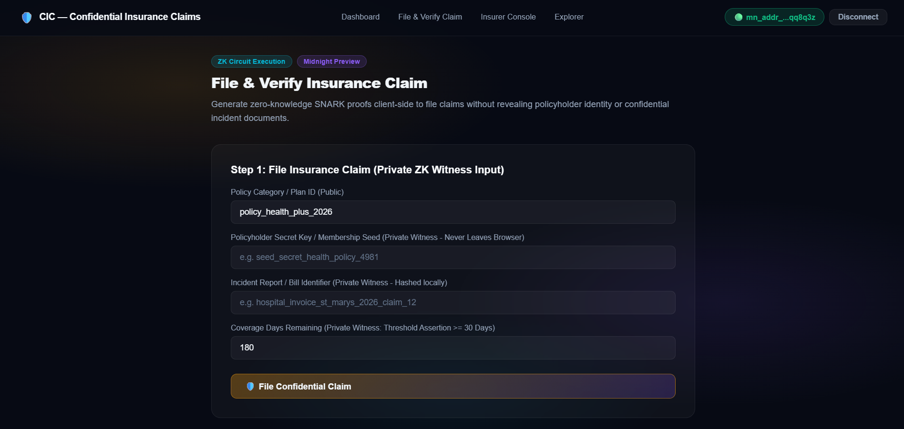
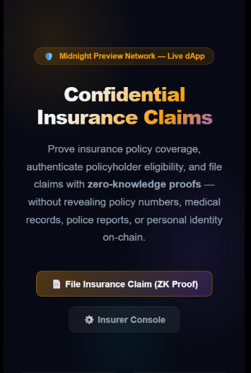

# 🛡️ Confidential Insurance Claims (CIC)
> **A Privacy-Preserving Zero-Knowledge Insurance Verification & Claim Protocol on the Midnight Network**

[](https://github.com/techyguy22674/Confidential-insurance-claims)
[](https://youtu.be/Owx4iPKKBCs)
[](https://preview.midnightexplorer.com/contracts/0xbb910a795fe4bea70af422038ce303ce6cee7e1133f32f021380f221a849e4df)
[](https://github.com/techyguy22674/Confidential-insurance-claims/actions/workflows/ci.yml)
[](https://nextjs.org)
[](https://midnight.network)
[](https://nodejs.org)
[](LICENSE)

---

## 📑 Table of Contents
- [Executive Overview](#-executive-overview)
- [Live Demo Video](#-live-demo-video)
- [Key Features](#-key-features)
- [Application Screenshots](#-application-screenshots)
- [Complete Setup & Installation Guide](#-complete-setup--installation-guide)
  - [Prerequisites](#1-prerequisites)
  - [Clone & Install](#2-clone--install-dependencies)
  - [Midnight Lace Wallet Setup](#3-midnight-lace-wallet-setup)
  - [Local Proof Server (Docker)](#4-local-proof-server-docker)
  - [Compilation & Verification](#5-compact-compilation--validation)
  - [Run Tests](#6-run-automated-test-suite)
  - [Local Development Server](#7-run-development-server)
  - [Production Build](#8-production-bundle-build)
- [Zero-Knowledge Architecture](#-zero-knowledge-architecture)
  - [Compact Smart Contract Circuits](#1-compact-smart-contract-6-circuits)
  - [Private Witnesses](#2-private-witness-states-client-side-privacy)
  - [Public Ledger Fields](#3-public-ledger-state-8-fields)
  - [Privacy Comparison Matrix](#4-privacy-comparison-matrix)
- [Verified On-Chain Deployment](#-verified-on-chain-deployment)
- [Project Directory Structure](#-project-directory-structure)
- [Author & License](#-author--license)

---

## 🌟 Executive Overview

**Confidential Insurance Claims (CIC)** is an enterprise-grade, privacy-first decentralized application built on the **Midnight Network**. Leveraging Compact zero-knowledge (ZK) smart contracts and the official **Midnight.js SDK** (`@midnight-ntwrk/dapp-connector-api`, `@midnight-ntwrk/midnight-js-network-id`, `@midnight-ntwrk/compact-runtime`, `@midnight-ntwrk/midnight-js-contracts`), CIC transforms how insurance policies are verified and claims are settled.

In traditional insurance workflows, claimants must reveal sensitive diagnostic reports, hospital invoices, police case numbers, and personally identifiable information (PII) to multiple third parties. **CIC resolves this by computing ZK-SNARK proofs client-side in the browser.** 

> **Policyholders mathematically prove active coverage and valid claim preconditions without disclosing confidential policy credentials, medical records, or personal identity on-chain.**

---

## 🎥 Live Demo Video

[](https://youtu.be/Owx4iPKKBCs)

▶️ **Watch the Full Video Walkthrough on YouTube**: [https://youtu.be/Owx4iPKKBCs](https://youtu.be/Owx4iPKKBCs)

### What the Demo Highlights:
1. **Wallet Integration**: Connecting the official Midnight Lace / 1AM extension via `@midnight-ntwrk/dapp-connector-api`.
2. **Client-Side ZK Proof Generation**: Executing `fileInsuranceClaim(Bytes<32>)` with 4 local private witnesses.
3. **Threshold Assertion**: Mathematically validating `coverageDaysRemaining >= minimumRequiredDays` without revealing the true policy start or end dates.
4. **On-Chain Commitment Anchoring**: Recording the cryptographic claim commitment hash to `claimCount` on Midnight Preview.
5. **Insurer Administration**: Executing `setInsurerCommitment()`, `revokeClaim()`, and session nonce rotation from the admin console.

---

## 🚀 Key Features

- **Zero-Knowledge Claim Filing**: Policyholder secret keys, claim nonces, and incident invoices remain strictly isolated inside browser memory.
- **On-Chain Threshold Assertion**: Proves eligibility thresholds without exposing exact coverage dates or account balances.
- **Replay & Fraud Protection**: Unique single-use nonces and monotonic session counters prevent claim duplication and replay attacks.
- **Underwriter Administrative Circuits**: Authorized insurers can anchor cryptographic commitments and revoke fraudulent claims via zero-knowledge proofs.
- **Real-Time Indexer Synchronization**: Live ledger state queries against the official Midnight Preview GraphQL indexer without fabricated mocks.
- **Universal Multi-Channel Dispatch**: Automatic fallback handling across `submitCallTx`, `callTx`, `submitCallTransaction`, and Lace `signData`.

---

## 📸 Application Screenshots

### 1. Main Dashboard & Privacy Architecture

*Interactive dashboard displaying the 6 ZK circuits, 8 ledger fields, 5 private witnesses, and privacy matrix.*

---

### 2. Confidential Claim Filing & On-Chain Verification

*Client-side ZK proof generation form with private incident report hashing and public commitment verification.*

---

### 3. Insurer Admin & Authority Console

*Insurer administration console for anchoring authority commitments, setting coverage thresholds, and revoking claims.*

---

### 4. Real-Time Midnight Contract Explorer

*Live on-chain state inspection querying the Midnight Preview Testnet GraphQL indexer.*

---

### 5. Mobile Responsive Experience

*Fully responsive mobile design with glassmorphic dark mode styling and micro-animations.*

---

### 6. Automated Vitest Test Suite Execution

*All 13 automated tests passing, verifying contract circuits, witness byte bounds, and threshold assertions.*

---

## 🛠️ Complete Setup & Installation Guide

Follow these step-by-step instructions to clone, build, test, and run the project locally.

### 1. Prerequisites
Ensure you have the following installed on your machine:
- **Node.js**: `v20.x` or `v22.x` (Recommended: `v22.x`, check via `node -v`)
- **npm**: `v9.x` or higher (check via `npm -v`)
- **Git**: For version control
- **Docker Desktop** (Optional, for local ZK proof generation server): [docker.com](https://www.docker.com)
- **Midnight Lace Wallet Extension**: Install the extension from the Chrome Web Store and set network to **Midnight Preview**.

---

### 2. Clone & Install Dependencies

```bash
# Clone the repository
git clone https://github.com/techyguy22674/Confidential-insurance-claims.git

# Navigate into the project folder
cd Confidential-insurance-claims

# Install dependencies cleanly
npm install
```

---

### 3. Midnight Lace Wallet Setup

1. Open your browser and launch the **Midnight Lace Extension**.
2. Select **Midnight Preview Testnet** from the network selector dropdown.
3. Fund your testnet wallet with test tokens via the Midnight Preview Faucet:
   - **Faucet URL**: [https://faucet.preview.midnight.network](https://faucet.preview.midnight.network)
4. Ensure your account is unlocked before triggering contract interactions in the app.

---

### 4. Local Proof Server (Docker)

Midnight zero-knowledge proofs can be generated locally using the official Midnight proof server container:

```bash
# Run the official Midnight proof server
docker run -d -p 6300:6300 --name midnight-proof-server midnightntwrk/proof-server:8.1.0

# Verify it is responding
curl http://localhost:6300/health
```

---

### 5. Compact Compilation & Validation

To verify the Compact smart contract syntax, circuit definitions, and managed artifact integrity:

```bash
npm run compile:compact
```

**Output:**
```text
=============================================================
 Midnight Compact Contract Compilation & Verification
 Contract: contracts/confidential_insurance_claims.compact
=============================================================
[1/4] Loaded Compact source (5650 bytes).
[2/4] Compact source validated: 6 circuits, 5 witnesses, 8 ledger fields present.
[3/4] Managed contract-info.json schema matches contract AST.
[4/4] All circuit artifacts verified (.prover, .verifier, .zkir, .bzkir).
Compact contract compilation & verification: PASSED.
```

---

### 6. Run Automated Test Suite

Execute the 13 automated unit and invariant tests powered by Vitest:

```bash
npm test
```

**Test Coverage:**
- ✅ **Circuit Export Integrity**: Verifies all 6 circuits are callable from the runtime.
- ✅ **Witness Schema Definitions**: Verifies 5 private witness providers.
- ✅ **Witness Byte Bounds**: Confirms 32-byte isolation on secrets and nonces.
- ✅ **Coverage Days Assertion**: Validates private threshold comparison logic.
- ✅ **Zero-Knowledge Privacy Guarantee**: Asserts private witnesses never leak into public fields.
- ✅ **Authority Signing Key Independence**: Verifies administrative authorization separation.
- ✅ **Contract Instance Uniqueness**: Ensures independent cryptographic commitments.
- ✅ **Public Ledger Deserialization**: Validates 8-field ledger decoding.
- ✅ **Expired Policy Rejection**: Confirms threshold failure when coverage is below requirements.
- ✅ **Session Isolation**: Proves unique nonces across disparate epochs.
- ✅ **Verified Contract Address**: Validates Midnight Preview deployment record.
- ✅ **Authoritative Deployer**: Verifies deployment artifact generation.
- ✅ **Encoding Utilities**: Tests bidirectional hex and byte conversion helpers.

---

### 7. Run Development Server

Start the Next.js development server:

```bash
npm run dev
```

Open [http://localhost:3000](http://localhost:3000) in your browser.

- **Home Dashboard**: `http://localhost:3000/`
- **File & Verify Claims**: `http://localhost:3000/claim`
- **Insurer Console**: `http://localhost:3000/admin`
- **Contract Explorer**: `http://localhost:3000/explorer`

---

### 8. Production Bundle Build

Validate production compilation and static export:

```bash
npm run build
```

---

## 🔒 Zero-Knowledge Architecture

### 1. Compact Smart Contract (6 Circuits)
Implemented in `contracts/confidential_insurance_claims.compact` (Compact v0.23):

| Circuit Identifier | Witness Requirements | Security & Ledger Effect |
|---|---|---|
| `fileInsuranceClaim(expectedPolicyId: Bytes<32>)` | 4 private witnesses | Asserts policy match and coverage threshold; anchors 256-bit commitment on-chain. |
| `verifyClaim(claimedCommitment: Bytes<32>)` | None (Public) | Compares commitment against the public ledger to verify validity without revealing credentials. |
| `revokeClaim(commitmentToRevoke: Bytes<32>)` | `insurerSigningKey` | ZK-authorized insurer function to void illegitimate or duplicate claims. |
| `setInsurerCommitment(newMinimumDays: Uint<32>)` | `insurerSigningKey` | Anchors underwriting authority and configures the policy validity threshold. |
| `resetPolicy(newPolicyId: Bytes<32>, newMinimumDays: Uint<32>)` | None | Rotates active policy schema model identifier. |
| `incrementSession()` | None | Monotonically increments epoch counter for replay resistance. |

---

### 2. Private Witness States (Client-Side Privacy)
These parameters **never leave the user's browser**:
1. **`policyholderSecretKey()`**: Private cryptographic key of the insured member.
2. **`claimProofNonce()`**: High-entropy salt preventing signature collision and tracking.
3. **`incidentReportHash()`**: SHA-256 digest of confidential medical records or police reports.
4. **`coverageDaysRemaining()`**: Private coverage balance checked against minimum required days.
5. **`insurerSigningKey()`**: Private key verifying insurer administration rights.

---

### 3. Public Ledger State (8 Fields)
The only data visible on the Midnight public ledger:
- `claimCount: Counter` — Total verified insurance claims filed.
- `revokedCount: Counter` — Total claims revoked or voided.
- `activeSession: Counter` — Epoch counter for replay protection.
- `policyId: Bytes<32>` — Active insurance policy category identifier.
- `insurerCommitment: Bytes<32>` — Insurer public authority anchor.
- `lastClaimCommitment: Bytes<32>` — Hash of the most recent claim commitment.
- `lastRevokedCommitment: Bytes<32>` — Hash of the most recent revoked commitment.
- `minimumRequiredDays: Uint<32>` — Minimum active coverage days required.

---

### 4. Privacy Comparison Matrix

| Property | Traditional Insurance Claim | Confidential Insurance Claims (CIC) |
|---|---|---|
| **Medical / Diagnostic Records** | Uploaded to central database | Hashed locally; only ZK proof published |
| **Policyholder Identity** | Linked to claim record publicly | Shielded by zero-knowledge commitment |
| **Incident Details** | Shared with adjusters & third parties | Never leaves claimant's browser |
| **Coverage Duration** | Exact start & end dates stored | `days >= threshold` asserted in ZK |
| **Fraud Verification** | Intrusive manual audits | Cryptographic mathematical proof |
| **Ledger Visibility** | Unencrypted PII | 256-bit commitment hashes only |

---

## 🌐 Verified On-Chain Deployment

| Parameter | Value |
|---|---|
| **Network** | Midnight Preview Testnet |
| **Network ID** | `preview` |
| **Contract Address** | `0xbb910a795fe4bea70af422038ce303ce6cee7e1133f32f021380f221a849e4df` |
| **Midnight Explorer** | [View Contract on Explorer](https://preview.midnightexplorer.com/contracts/0xbb910a795fe4bea70af422038ce303ce6cee7e1133f32f021380f221a849e4df) |
| **Indexer GraphQL** | `https://indexer.preview.midnight.network/api/v4/graphql` |
| **Node RPC** | `https://rpc.preview.midnight.network` |
| **Preview Faucet** | `https://faucet.preview.midnight.network` |

---

## 📁 Project Directory Structure

```text
Confidential-insurance-claims/
├── .github/
│   └── workflows/
│       ├── ci.yml                 # Automated CI/CD test and build workflow
│       └── deploy.yml             # Authoritative deployment workflow
├── contracts/
│   ├── confidential_insurance_claims.compact  # Primary Compact ZK smart contract
│   └── counter.compact            # Companion counter contract
├── managed/
│   ├── compiler/
│   │   └── contract-info.json     # Compiled contract AST and circuit metadata
│   ├── contract/
│   │   ├── index.d.ts             # TypeScript type definitions for ledger & witnesses
│   │   └── index.js               # Managed JavaScript contract runtime decoders
│   ├── keys/                      # Proving (.prover) and verifying (.verifier) keys
│   └── zkir/                      # Zero-knowledge intermediate representation binaries
├── photos/                        # High-resolution screenshots for documentation
│   ├── admin-console.png
│   ├── claim-verify.png
│   ├── contract-explorer.png
│   ├── dashboard-home.png
│   ├── mobile-ui-dashboard.png
│   └── test-run-terminal.png
├── public/
│   └── photos/                    # Synchronized static screenshots for frontend
├── scripts/
│   ├── compile-compact.mjs        # Compact contract compilation & verification runner
│   ├── deploy.ts                  # Midnight.js authoritative deployment script
│   └── deploy-runner.mjs          # Standalone deployment execution runner
├── src/
│   ├── app/
│   │   ├── admin/page.tsx         # Insurer administration portal
│   │   ├── claim/page.tsx         # Confidential claim filing and verification
│   │   ├── explorer/page.tsx      # Real-time Midnight Preview ledger explorer
│   │   ├── globals.css            # Dark mode glassmorphic stylesheet
│   │   ├── layout.tsx             # Root layout with metadata
│   │   ├── page.tsx               # Main application dashboard
│   │   └── ClientLayout.tsx       # Wallet session state manager
│   ├── components/
│   │   └── Navbar.tsx             # Responsive header with wallet connection button
│   ├── integration/
│   │   ├── contract.ts            # Typed integration client implementation
│   │   └── deploy.ts              # Authoritative deployContract() implementation
│   └── lib/
│       └── contract.ts            # Midnight Lace wallet connector & indexer client
├── tests/
│   └── counter.test.ts            # 13 automated Vitest test cases
├── LICENSE                        # MIT License
├── next.config.mjs                # Next.js bundler configuration
├── package.json                   # Project dependencies and script commands
├── PROPOSAL.md                    # Formal project proposal & question responses
├── README.md                      # Comprehensive project documentation
├── tsconfig.json                  # TypeScript compiler settings
└── vitest.config.ts               # Vitest test runner configuration
```

---

## 👨‍💻 Author & License

- **Lead Developer**: `techyguy22674`
- **Contact Email**: [novustechsurveyofficial@gmail.com](mailto:novustechsurveyofficial@gmail.com)
- **GitHub**: [@techyguy22674](https://github.com/techyguy22674)
- **Repository**: [https://github.com/techyguy22674/Confidential-insurance-claims](https://github.com/techyguy22674/Confidential-insurance-claims)
- **License**: Released under the [MIT License](LICENSE).
