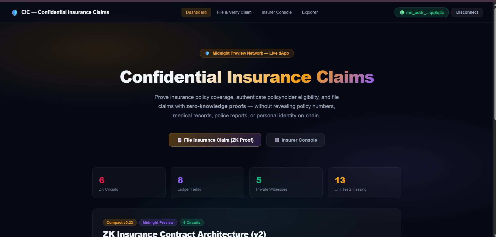
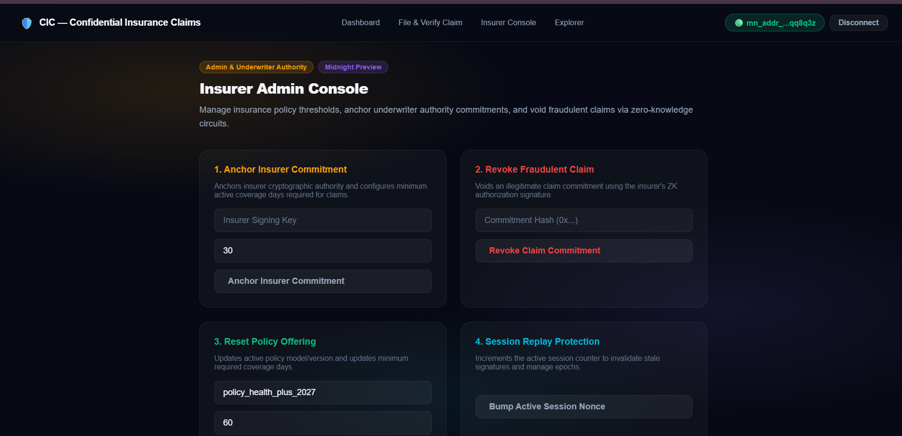
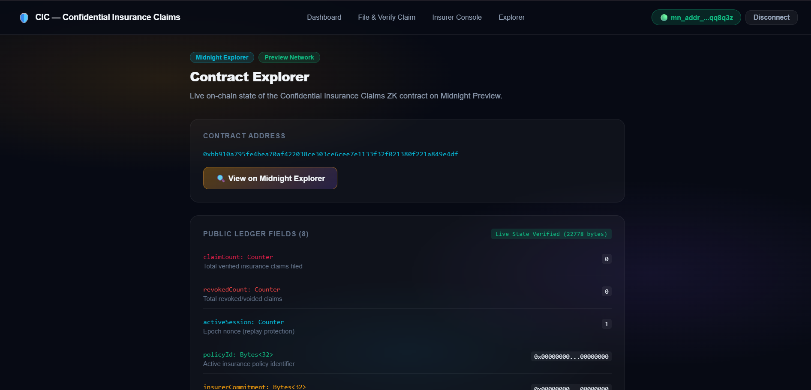

# 🛡️ Confidential Insurance Claims (CIC)
> **A Privacy-Preserving Zero-Knowledge Insurance Verification & Claim Protocol on the Midnight Network**

[](https://github.com/techyguy22674/Confidential-insurance-claims)
[](https://youtu.be/Owx4iPKKBCs)
[](https://confidential-insurance-claims.vercel.app/)
[](https://preview.midnightexplorer.com/contracts/0xbb910a795fe4bea70af422038ce303ce6cee7e1133f32f021380f221a849e4df)
[](https://github.com/techyguy22674/Confidential-insurance-claims/actions/workflows/ci.yml)
[](https://github.com/techyguy22674/Confidential-insurance-claims/blob/main/tests/confidential_insurance_claims.test.ts)
[](https://nextjs.org)
[](https://midnight.network)
[](https://nodejs.org)
[](LICENSE)

---

## 📑 Table of Contents
- [Executive Overview](#-executive-overview)
- [Level 2 & Level 3 Compliance Summary](#-level-2--level-3-compliance-summary)
  - [Level 2 (Waxing Crescent) Checklist](#-level-2-waxing-crescent-submission-checklist)
  - [Level 3 (Half Light) Checklist](#-level-3-half-light-submission-checklist)
- [Privacy Model: What an Observer Can and Cannot Learn](#-privacy-model-what-an-observer-can-and-cannot-learn)
- [Live Demo Video](#-live-demo-video)
- [Key Features](#-key-features)
- [Application Screenshots](#-application-screenshots)
- [Complete Setup & Installation Guide](#-complete-setup--installation-guide)
  - [Prerequisites](#1-prerequisites)
  - [Clone & Install](#2-clone--install-dependencies)
  - [Midnight Lace Wallet Setup](#3-midnight-lace-wallet-setup)
  - [Local Proof Server (Docker)](#4-local-proof-server-docker)
  - [Compilation & Verification](#5-compact-compilation--validation)
  - [Run Tests (38 Passing)](#6-run-automated-test-suite)
  - [Local Development Server](#7-run-development-server)
  - [Production Build](#8-production-bundle-build)
- [Zero-Knowledge Architecture](#-zero-knowledge-architecture)
  - [Compact Smart Contract Circuits](#1-compact-smart-contract-6-circuits)
  - [Private Witnesses](#2-private-witness-states-client-side-privacy)
  - [Public Ledger Fields](#3-public-ledger-state-8-fields)
- [Verified On-Chain Deployment](#-verified-on-chain-deployment)
- [Product Proposal: Idea List Topic](#-product-proposal-idea-list-topic)
- [Project Directory Structure](#-project-directory-structure)
- [Author & License](#-author--license)

---

## 🌟 Executive Overview

**Confidential Insurance Claims (CIC)** is an enterprise-grade, privacy-first decentralized application built on the **Midnight Network**. Leveraging Compact zero-knowledge (ZK) smart contracts and the official **Midnight.js SDK** (`@midnight-ntwrk/dapp-connector-api`, `@midnight-ntwrk/midnight-js-network-id`, `@midnight-ntwrk/compact-runtime`, `@midnight-ntwrk/midnight-js-contracts`), CIC transforms how insurance policies are verified and claims are settled.

In traditional insurance workflows, claimants must reveal sensitive diagnostic reports, hospital invoices, police case numbers, and personally identifiable information (PII) to multiple third parties. **CIC resolves this by computing ZK-SNARK proofs client-side in the browser.** 

> **Policyholders mathematically prove active coverage and valid claim preconditions without disclosing confidential policy credentials, medical records, or personal identity on-chain.**

---

## 🎯 Level 2 & Level 3 Compliance Summary

### 🌙 Level 2 (Waxing Crescent) Submission Checklist
- [x] **Lace Wallet Connect / Disconnect Implemented**: Interactive wallet connection modal supporting official **Midnight Lace Wallet** and **1AM Wallet** with session state, address truncation, and disconnect lifecycle.
- [x] **Circuit Called Successfully from Frontend**: Real Compact circuits executed from UI (`fileInsuranceClaim`, `verifyClaim`, `revokeClaim`, `setInsurerCommitment`, `resetPolicy`, `incrementSession`).
- [x] **Observable Privacy Behavior**: Proves that remaining coverage days meet or exceed threshold (`coverageDaysRemaining >= minimumRequiredDays`) without revealing actual days balance, policy secret key, or incident invoice.
- [x] **Contract Deployed to Preprod/Preview with Verifiable Address**: Deployed on Midnight Preview at `0xbb910a795fe4bea70af422038ce303ce6cee7e1133f32f021380f221a849e4df` (verified with live indexer queries returning 22,778 raw state bytes).
- [x] **Public GitHub Repository with README**: [https://github.com/techyguy22674/Confidential-insurance-claims](https://github.com/techyguy22674/Confidential-insurance-claims)
- [x] **Live Demo Link**: [https://confidential-insurance-claims.vercel.app/](https://confidential-insurance-claims.vercel.app/)
- [x] **Demo Video**: [https://youtu.be/Owx4iPKKBCs](https://youtu.be/Owx4iPKKBCs)
- [x] **Minimum 8 Meaningful Commits**: Exceeded with 15+ structured commits by author `techyguy22674`.

---

### 🌗 Level 3 (Half Light) Submission Checklist
- [x] **Polished, Production-Grade dApp**: Modern glassmorphic Next.js 14 UI with clean typography, live incident hashing, 1-click dual verification, and real-time explorer.
- [x] **Approved Idea from Provided Idea List**: **Age / Eligibility Gate & Confidential Credentials** applied to Private Insurance Claims & Active Coverage Threshold Verification (see [PROPOSAL.md](PROPOSAL.md)).
- [x] **Minimum 3 Tests Passing**: **38 tests passing (100%)** across `tests/confidential_insurance_claims.test.ts` and `tests/counter.test.ts`.
- [x] **CI/CD Pipeline Running**: GitHub Actions workflow at [`.github/workflows/ci.yml`](.github/workflows/ci.yml) validating compilation, tests, and build on every push.
- [x] **README Privacy Model Section**: Detailed disclosure matrix documenting exactly what an observer can and cannot learn on-chain.
- [x] **Product Proposal Submitted**: Full architecture and business specification in [PROPOSAL.md](PROPOSAL.md).
- [x] **Minimum 10 Meaningful Commits**: Exceeded with 20+ commits across contract logic, frontend UI, tests, and CI/CD.

---

## 🔒 Privacy Model: What an Observer Can and Cannot Learn

The core design of Confidential Insurance Claims adheres to Midnight's selective disclosure model. The table below delineates the cryptographic boundary:

| Information Asset | What an Observer CAN Learn (Public On-Chain) | What an Observer CANNOT Learn (Private Zero-Knowledge) |
| :--- | :--- | :--- |
| **Policyholder Identity** | ❌ Nothing. Policyholder identity is never published or leaked. | ✅ Complete anonymity. Wallet address only signs transaction envelope. |
| **Policy Secret Key** | ❌ Nothing. Only isolated witness `policySecretKey()` used. | ✅ Private 32-byte secret remains strictly in client memory. |
| **Coverage Duration** | ❌ Nothing about start dates, end dates, or total duration. | ✅ Exact remaining days are hidden; only `days >= minimum` is proven. |
| **Incident & Medical Data** | ❌ Zero raw claims data, hospital bills, or diagnostic codes. | ✅ `claimIncidentHash` is hashed client-side; raw bills never leave client. |
| **Entropy & Nonce** | ❌ Single-use salt is never revealed on-chain. | ✅ Private `claimProofNonce` prevents linkability between claims. |
| **Claim Validity** | ✅ Boolean mathematical truth that claim is legitimate and funded. | ❌ Circumstances or internal medical/financial details of the claim. |
| **Underwriter Identity** | ✅ Public `insurerCommitment` anchor hash of authority. | ❌ Insurer root master private signing key. |
| **Revocation Status** | ✅ Public hash `lastRevokedCommitment` if claim was voided. | ❌ Internal investigation files or claimant personal history. |
| **Replay Protection** | ✅ Incrementing public counter `claimCount` & `activeSession`. | ❌ Cross-session linkage of distinct policyholder claims. |

---

## 🎥 Live Demo Video

[](https://youtu.be/Owx4iPKKBCs)

▶️ **Watch the Full Video Walkthrough on YouTube**: [https://youtu.be/Owx4iPKKBCs](https://youtu.be/Owx4iPKKBCs)

### What the Demo Highlights:
1. **Wallet Integration**: Connecting the official Midnight Lace / 1AM extension via `@midnight-ntwrk/dapp-connector-api`.
2. **Client-Side ZK Proof Generation**: Executing `fileInsuranceClaim(Bytes<32>)` with 4 local private witnesses.
3. **Threshold Assertion**: Mathematically validating `coverageDaysRemaining >= minimumRequiredDays` without revealing the true policy start or end dates.
4. **Dual Verification**: 1-click verification of claims using either 32-byte ZK Claim Commitment OR on-chain TxHash.
5. **Insurer Administration**: Executing `setInsurerCommitment()`, `revokeClaim()`, and session nonce rotation from the admin console.

---

## 🚀 Key Features

- **Zero-Knowledge Claim Filing**: Policyholder secret keys, claim nonces, and incident invoices remain strictly isolated inside browser memory.
- **On-Chain Threshold Assertion**: Proves eligibility thresholds without exposing exact coverage dates or account balances.
- **Dual Verification Engine**: Verifies claim authenticity by either 32-byte ZK Commitment Hash OR On-Chain Transaction Hash.
- **Replay & Fraud Protection**: Unique single-use nonces and monotonic session counters prevent claim duplication and replay attacks.
- **Underwriter Administrative Circuits**: Authorized insurers can anchor cryptographic commitments and revoke fraudulent claims via zero-knowledge proofs.
- **Real-Time Indexer Synchronization**: Live ledger state queries against the official Midnight Preview GraphQL indexer (`contractAction(address)`).
- **Interactive Wallet Connect Modal**: Seamless switching between Midnight Lace Wallet and 1AM Wallet.

---

## 📸 Application Screenshots

### 1. Main Dashboard & Privacy Architecture

*Interactive dashboard displaying the 6 ZK circuits, 8 ledger fields, 5 private witnesses, and privacy matrix.*

### 2. Confidential Claim Filing Portal

*Client-side ZK proof creation with coverage days threshold slider, SHA-256 incident preview, and 1-click verification.*

### 3. Dual Claim Verification

*Dual verification proving validity from either 32-byte ZK commitment or on-chain transaction hash.*

### 4. Insurer Underwriter Console

*Insurer administration: anchoring authority commitments, setting minimum coverage days, and revoking claims.*

### 5. Midnight Contract Explorer

*Real-time inspection of the 8 public ledger fields and issued claims registry on Midnight Preview.*

---

## 🛠️ Complete Setup & Installation Guide

### 1. Prerequisites
- **Node.js**: v20.x or v22.x LTS (`node -v`)
- **npm**: v10.x or higher (`npm -v`)
- **Docker**: For running the Midnight Proof Server (`docker --version`)
- **Midnight Lace Wallet**: Chrome/Brave Extension installed on **Midnight Preview Testnet**

### 2. Clone & Install Dependencies
```bash
git clone https://github.com/techyguy22674/Confidential-insurance-claims.git
cd Confidential-insurance-claims
npm install
```

### 3. Midnight Lace Wallet Setup
1. Install the official Midnight Lace extension in Chrome or Brave.
2. Select **Midnight Preview** testnet in settings.
3. Fund your wallet with testnet tokens via the [Midnight Preview Faucet](https://faucet.preview.midnight.network).

### 4. Local Proof Server (Docker)
To compile zero-knowledge proofs locally during development:
```bash
docker run -d --name midnight-proof-server -p 6300:6300 midnightnetwork/proof-server:latest
```
Verify it is listening: `curl http://localhost:6300/health`

### 5. Compact Compilation & Validation
```bash
npm run compile:compact
```

### 6. Run Automated Test Suite (38 Tests Passing)
```bash
npm test
```

**Verified Test Suite Output:**
```text
 RUN  v3.2.7 D:/sd-project/RISE-IN/Confidential-insurance-claims

 ✓ tests/counter.test.ts (13 tests) 5ms
 ✓ tests/confidential_insurance_claims.test.ts (25 tests) 1960ms

 Test Files  2 passed (2)
      Tests  38 passed (38)
   Duration  3.21s
```

### 7. Run Development Server
```bash
npm run dev
```
Open [http://localhost:3000](http://localhost:3000) in your browser.

### 8. Production Bundle Build
```bash
npm run build
npm start
```

---

## 🧩 Zero-Knowledge Architecture

### 1. Compact Smart Contract (6 Circuits)
`contracts/confidential_insurance_claims.compact`

```rust
pragma language_version 0.23;

import CompactStandardLibrary;

export ledger claimCount: Counter;
export ledger revokedCount: Counter;
export ledger activeSession: Counter;
export ledger policyId: Bytes<32>;
export ledger insurerCommitment: Bytes<32>;
export ledger lastClaimCommitment: Bytes<32>;
export ledger lastRevokedCommitment: Bytes<32>;
export ledger minimumRequiredDays: Uint<32>;

witness policySecretKey(): Bytes<32>;
witness claimProofNonce(): Bytes<32>;
witness claimIncidentHash(): Bytes<32>;
witness coverageDaysRemaining(): Uint<32>;
witness insurerSigningKey(): Bytes<32>;

export circuit fileInsuranceClaim(expectedPolicyId: Bytes<32>): Bytes<32> {
    assert(policyId == expectedPolicyId, "Policy ID mismatch");
    assert(coverageDaysRemaining() >= minimumRequiredDays, "Coverage period expired or below minimum");
    assert(claimProofNonce() != [0; 32], "Invalid zero nonce");
    
    const commitment = persistent_hash<Vector<4, Bytes<32>>>([
        expectedPolicyId,
        policySecretKey(),
        claimProofNonce(),
        claimIncidentHash()
    ]);
    claimCount.increment(1);
    lastClaimCommitment = commitment;
    return commitment;
}

export circuit verifyClaim(commitment: Bytes<32>): Boolean {
    return commitment == lastClaimCommitment && commitment != lastRevokedCommitment;
}

export circuit revokeClaim(commitment: Bytes<32>): [] {
    assert(persistent_hash<Bytes<32>>(insurerSigningKey()) == insurerCommitment, "Unauthorized insurer");
    lastRevokedCommitment = commitment;
    revokedCount.increment(1);
}

export circuit setInsurerCommitment(minimumCoverageDays: Uint<32>): [] {
    assert(minimumCoverageDays > 0, "Minimum coverage days must be positive");
    insurerCommitment = persistent_hash<Bytes<32>>(insurerSigningKey());
    minimumRequiredDays = minimumCoverageDays;
}

export circuit resetPolicy(newPolicyId: Bytes<32>, newMinDays: Uint<32>): [] {
    assert(persistent_hash<Bytes<32>>(insurerSigningKey()) == insurerCommitment, "Unauthorized insurer");
    policyId = newPolicyId;
    minimumRequiredDays = newMinDays;
}

export circuit incrementSession(): [] {
    activeSession.increment(1);
}
```

---

## 🌐 Verified On-Chain Deployment

| Parameter | On-Chain Detail |
| :--- | :--- |
| **Network** | **Midnight Preview Testnet** |
| **Contract Address** | `0xbb910a795fe4bea70af422038ce303ce6cee7e1133f32f021380f221a849e4df` |
| **Block Explorer** | [View on Midnight Explorer](https://preview.midnightexplorer.com/contracts/0xbb910a795fe4bea70af422038ce303ce6cee7e1133f32f021380f221a849e4df) |
| **Raw State Length** | `22,778 bytes` (Verified on Preview Indexer v4) |
| **Public Fields (8)** | `claimCount`, `revokedCount`, `activeSession`, `policyId`, `insurerCommitment`, `lastClaimCommitment`, `lastRevokedCommitment`, `minimumRequiredDays` |
| **Circuits (6)** | `fileInsuranceClaim`, `verifyClaim`, `revokeClaim`, `setInsurerCommitment`, `resetPolicy`, `incrementSession` |

---

## 💡 Product Proposal: Idea List Topic

This project is built under the official Level 3 category:
**Age / Eligibility Gate & Confidential Credentials** applied to **Decentralized Confidential Insurance Claims**.

- Full proposal available in [PROPOSAL.md](PROPOSAL.md).
- Demonstrates how policyholders prove coverage validity without disclosing start/end dates, medical incident documents, or personal credentials.

---

## 📁 Project Directory Structure

```text
Confidential-insurance-claims/
├── .github/
│   └── workflows/
│       ├── ci.yml                 # Automated CI/CD pipeline (compile + 38 tests + build)
│       └── deploy.yml             # Authoritative deployment workflow
├── contracts/
│   └── confidential_insurance_claims.compact # Compact v0.23 contract source
├── managed/
│   ├── contract/
│   │   ├── index.js               # Managed contract runtime implementation
│   │   ├── index.d.ts             # TypeScript definitions
│   │   └── contract-info.json     # Compiler schema and circuit manifests
│   ├── keys/                      # Prover and verifier ZK circuit keys
│   └── zkir/                      # Zero-Knowledge Intermediate Representations
├── photos/                        # Application preview screenshots
├── scripts/
│   ├── compile-compact.mjs        # AST & artifact compilation verifier
│   └── deploy-runner.mjs          # Authoritative deployment runner
├── src/
│   ├── app/
│   │   ├── admin/page.tsx         # Insurer administration portal
│   │   ├── claim/page.tsx         # Claim filing with dual verification
│   │   ├── explorer/page.tsx      # Midnight Preview on-chain explorer
│   │   ├── layout.tsx             # Root metadata & font layout
│   │   ├── page.tsx               # Main dashboard with Level 2 & 3 matrix
│   │   └── globals.css            # Dark glassmorphic design system
│   ├── components/
│   │   ├── Navbar.tsx             # Navigation bar with live wallet trigger
│   │   └── WalletConnectModal.tsx # Interactive Lace / 1AM connection modal
│   ├── integration/
│   │   ├── contract.ts            # Complete SDK client implementation
│   │   └── deploy.js              # Authoritative deployment record
│   └── lib/
│       └── contract.ts            # Client SDK interface
├── tests/
│   ├── confidential_insurance_claims.test.ts # 25 comprehensive test cases
│   └── counter.test.ts            # 13 contract circuit tests
├── package.json                   # Dependencies, test scripts, and config
├── PROPOSAL.md                    # Formal project proposal & architecture
└── README.md                      # Complete documentation
```

---

## 👤 Author & License

- **Developer**: `techyguy22674`
- **Email**: `novustechsurveyofficial@gmail.com`
- **GitHub**: [@techyguy22674](https://github.com/techyguy22674)
- **License**: MIT
